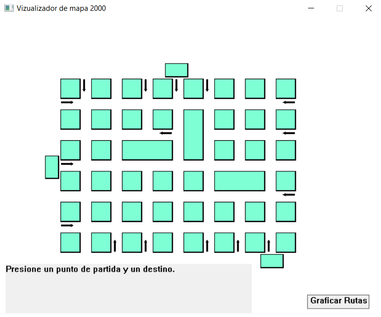

# Map visualizer 2000

A map visualizer allowing to make queries about the shortest path between two diferent locations in the map. Made using graph theory.  

### How to run 

You can download the .exe file in the x64 build folder or you can clone this repository.

## How to use 

##### Show the shortest path to reach from a start point to a destination.

1. Click on any street intersection, which will be the starting point for the path.
2. Click on any different street intersection to select the destination and the shortest path will be drawn immediately.            

***
- Click anywhere in the program to clear the map and start again.

***
##### Simultaneous paths:

- Click the button "Draw Paths" and  some posible autobus paths will be painted on the map. Those paths are will cover the whole map as much as posible. every path will be painted with a delay of .5 seconds 

